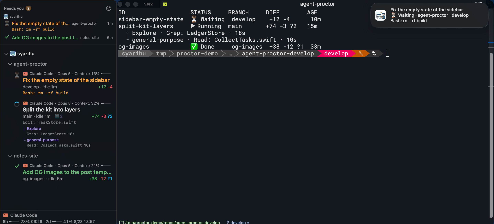
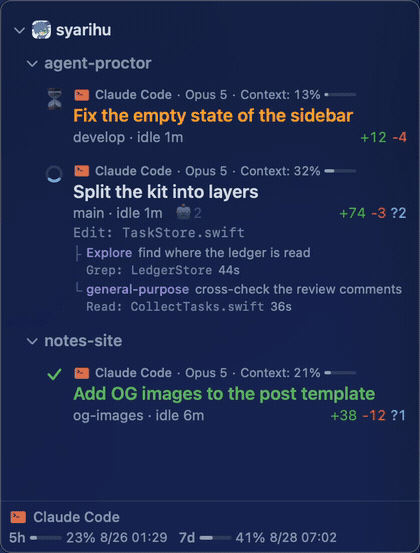
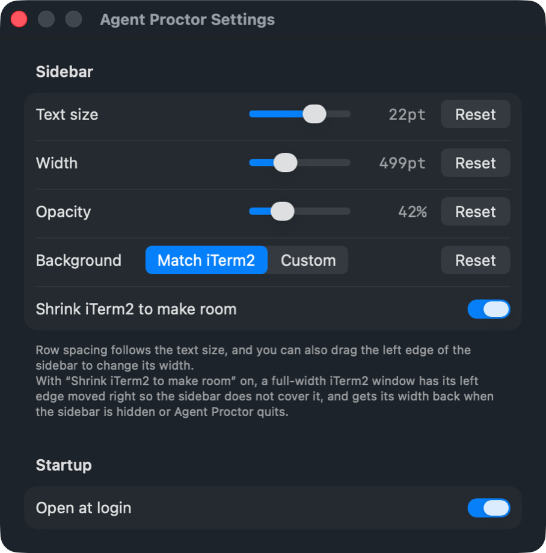
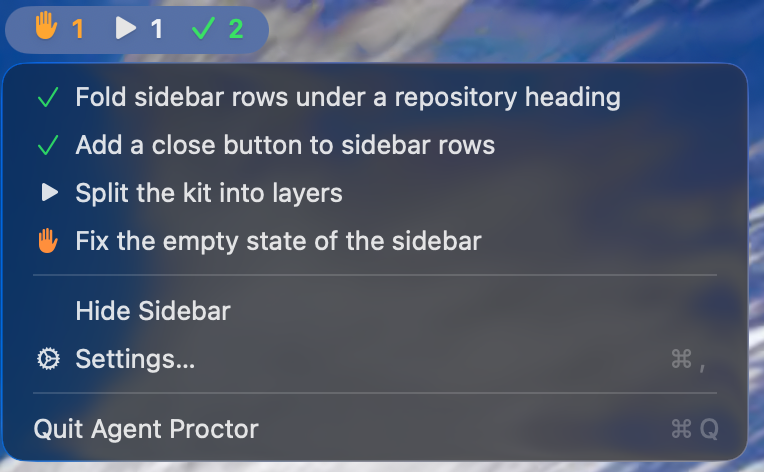

English | [日本語](README.ja.md)

<p align="center">
  
</p>

# agent-proctor

A Mac app and CLI that acts as your proctor, watching over every coding agent
at work across your git worktrees — one iTerm2 tab each — and telling you the
moment one raises its hand.

A proctor does not sit the exam. They watch the room, and they go to whoever
raises a hand. That is exactly the job here: instead of checking tabs one by one,
you see which session is blocked waiting for you and which one is still working
in the background.

The app is one half of a pair with iTerm2. The sidebar rides against the edge
of your iTerm2 window and every row stands for one of its tabs, so clicking a row
goes to that tab. The `proctor` CLI is not tied to a terminal and lists every
session all the same.

<p align="center">
  
</p>

The session name, context usage and subagent count are things a tab cannot tell
you. `elapsed` is the time since the status last changed — if something has been
running for a long time, that is a hint that it is either thinking hard or stuck.
The tool line is what the agent is touching right now, and subagents hang under
the session that spawned them, one row each. When the branch has a pull request,
its number leads that line and takes you to it in the browser; the colour says
whether it is open, merged or closed, and a draft stays dim.

```
⏳ Fix the empty state of the sidebar  (context: 13%)
   #128 develop · elapsed: 59s
▶ Split the kit into layers  (context: 32%)
   main · elapsed: 1m  🤖2              +74 -3 ?2
   Edit: TaskStore.swift
   ├ Explore  find where the ledger is read
   │    Grep: LedgerStore · 12s
   └ general-purpose  cross-check the review comments
        Read: CollectTasks.swift · 48s
```

Everything you have not dealt with is gathered into a `Needs you` strip pinned
at the top of the sidebar: a session stopped for your approval, a finished one
you have not dealt with, and one that fell over that you have not dealt with
either.
A row that is waiting also carries what it is waiting for — `Bash: rm -rf
build`, the command sitting in the permission prompt. A waiting row leaves the
strip the moment you answer that prompt; a finished or failed one leaves once
you visit its tab.

Visiting the tab is only the default. *Settings…* has a `Needs you` section
where a notice for a finished or failed session can be made to stay until you
clear it by hand, so having looked at something does not count as having
replied to it. It then goes once that session moves again — sending it an
instruction is enough — or once you press the ✓ on the notice. Only the strip
keeps it: the row in the list below turns ✔ the moment you visit its tab, so
the list stays a picture of where things are and the strip stays the list of
what is left to do.

When you are not looking at the sidebar at all, macOS says it for you: a
notification goes out the moment a session starts waiting for you, finishes, or
falls over. Clicking it goes to that tab, exactly like clicking a row.

<p align="center">
  
</p>

## Install

### Homebrew (recommended)

```bash
brew install syarihu/tap/agent-proctor
proctor sidebar
```

### From source

```bash
scripts/create-signing-cert.sh   # once. Creates a local code signing certificate
scripts/install.sh               # installs to /Applications and links ~/bin/proctor
```

The certificate comes first because Automation (Apple Events) permission is tied
to the pair of bundle identifier and code signature. An ad-hoc signature changes on
every build, so macOS would ask you to approve controlling iTerm2 again each time.

Installing over a running copy does not replace the one that is running. Quit
Agent Proctor and open it again afterwards — `brew upgrade` included. The CLI needs
nothing: every invocation reads the bundle it is linked to.

On first launch macOS asks for permission to control iTerm2, and to send
notifications. It only ever asks once. If you refuse, open *Settings…* from
the menu bar item: its *Permission* section shows where each stands and takes you
to the right page of System Settings. Refusing notifications costs you the banners
only — the sidebar and the `Needs you` strip carry on regardless.

Open *Settings…* and turn on *Open at login*, and it will start on its own from
then on. The sidebar's text size, width and grouping are set there too.

<p align="center">
  
</p>

## Wiring up your agent

Installing it is not enough — the list stays empty. agent-proctor is a passive
tool that reads a ledger and shows it; what writes to that ledger is your agent's
hooks (Claude Code, Antigravity or Codex).

How to wire them up depends on your setup — existing hooks or a statusLine have to
be merged rather than replaced — so instead of a procedure it is written as
instructions for an AI to follow, and proctor prints them:

```bash
proctor setup ls        # which agents there are guides for
proctor setup claude    # or agy, codex, other
proctor setup all       # every guide at once
```

→ in Claude Code, `! proctor setup claude` does it with nothing to install first;
anywhere else, run the command and hand its output to the agent.

The guides live at
[`Sources/ProctorKit/Resources/en.lproj/`](Sources/ProctorKit/Resources/en.lproj/)
if you would rather read one before installing anything.

## Usage

```bash
proctor ls              # list (--all for every repository, --json for machines)
proctor worktree ls     # list the worktrees, running or not (--all, --json)
proctor skill [name]    # print a procedure for your agent to follow (no name lists them)
proctor setup [agent]   # print how to wire proctor up (no name lists the agents)
proctor attach <id>     # open the agent (claude / agy / codex) for that session, resuming it
proctor rm <id>         # drop one row from the ledger (the worktree is left alone)
proctor title <text>    # name the session you are in (empty text clears it)
proctor sidebar         # launch the sidebar app
proctor --version       # print the version
```

That is the whole surface. Sessions appear on their own as soon as your hooks
report them and leave once the agent exits, so there is nothing to register by
hand. The app and the CLI never create or remove a worktree — they read the
ledger, `git worktree list` and `git diff`, and write nothing but the ledger.

Clicking a row in the sidebar focuses that tab if it is still alive, and otherwise
opens a new tab resuming the conversation. Hovering a row reveals a close button
that drops it from the list — the worktree is left alone, and a session that is
still running comes back on its next hook.

Rows sit under the repository they belong to, and those repositories sit under the
account or organization that owns them, each heading carrying its avatar. Clicking
a heading folds it away; the two levels fold independently, and the folds are
remembered across restarts. A folded heading carries the tally of what is inside
it (`⏳1 ▶2 ⌁2`), so a session waiting on you still shows while its group is closed.
The last of those counts the worktrees with nobody in them; it is deliberately a
different mark in no status colour, because a worktree has no status of its own.
The owner comes from the git remote rather than from where the repository sits on
disk, so it does not matter how you lay out your clones. Without `gh` installed
and signed in, the sidebar groups by repository alone.

A repository does not leave the list when its last session ends — it only sinks
below the ones that are still moving, and comes back with its heading folded. What
stays is what you were in over the last week; older ones show only while a tab is
open in them. Pointing at a heading reveals a `+` that opens a new tab in that
repository, which is the one-click way back to somewhere you have not been since
yesterday; reaching a worktree you left behind takes three, since the heading and
its worktree line both start folded.

The menu bar carries the same tally, and its menu lists every session with the
same marks. Picking one goes to that tab, exactly as clicking a row does.

<p align="center">
  
</p>

### Worktrees

Sessions come and go; worktrees stay. When the last session in one ends, what
remains on disk is a directory nobody is looking at any more.

```bash
proctor worktree ls            # this repository
proctor worktree ls --all      # every repository proctor has seen
proctor worktree ls --json     # the same facts, for an agent to read
```

```
agent-proctor
WORKTREE  BRANCH       STATE                 DIFF   IDLE
work      feature      in use (2)            +1 ?1  3m
spike     spike        nobody here           +1     2d
merged    merged-work  done, safe to remove         6d
```

Each one comes with the sessions running in it, its uncommitted changes, whether
its branch has been merged, and how long it has been since its last commit.

In the sidebar the same list sits under its repository as one folded line —
*worktrees with no session: 3 · 1 can go* — because a pile of abandoned
directories must never bury the session that is waiting for you.

Making a worktree and sweeping it up afterwards is the agent's job, and the
procedure ships with proctor:

```bash
proctor skill ls          # which procedures there are
proctor skill worktree    # print one, for an agent to follow
```

The text lives in proctor rather than in your agent's configuration, so
updating proctor updates it everywhere at once. With no setup at all, typing
`! proctor skill worktree` in Claude Code drops the guide straight into the
conversation.

## Design

`ProctorKit` is split into three layers so that the logic serves both the CLI and
the app. The boundary rule is that presentation concerns never enter the Kit:
terminal ANSI colors live in the CLI and SwiftUI colors in the app, and all the
Kit knows is which statuses exist and what to call them.

| Layer | What goes in it |
| --- | --- |
| `Model/` | Data and vocabulary. No I/O |
| `Repository/` | The only door to the outside: the ledger, git and the environment |
| `UseCase/` | One per thing you want to do. Every decision lives here |

`Localized` sits outside the three, because every layer needs words and looking
one up decides nothing. The views — `proctor/` for the CLI, `ProctorApp/` for the
app — call a use case and format what comes back.

| File | Role |
| --- | --- |
| `~/.local/state/proctor/state.json` | The ledger. One across all repositories. Created on first use |
| `~/.local/state/proctor/avatars/` | Organization avatars, one per owner. Safe to delete; they are fetched again |

The reasoning behind each rule is kept in the code, as a comment at the place it
applies. Copying it here as well would only let the two drift apart.

## Dependencies

`git`, and nothing else. There are no external Swift package dependencies.

## Contributing

See [CLAUDE.md](CLAUDE.md) for the conventions used in this repository
(English commit messages, Japanese code comments, and how to check behaviour
before and after a change).

## License

This project is licensed under the MIT License - see the [LICENSE](LICENSE) file for details.
