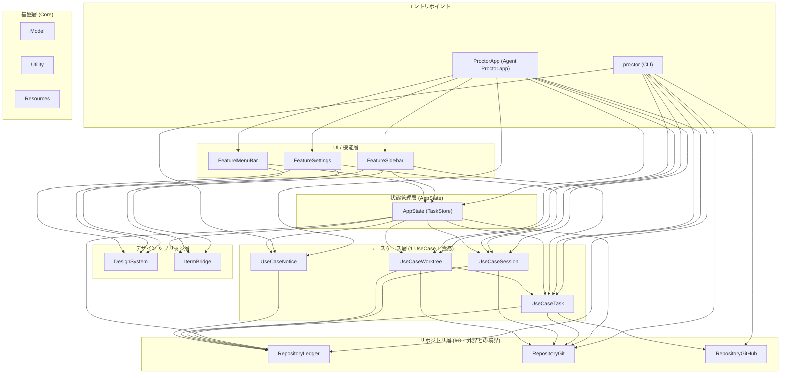

# アーキテクチャ

> 英語版が正本 ([architecture.md](architecture.md))

Proctor は、外部パッケージ依存を持たないマルチターゲットの Swift Package Manager (SPM) アーキテクチャで構成されています。プレゼンテーション、ドメイン判断、外部 I/O を明確な層に分離することで、コマンドラインツール (`proctor`) と macOS メニューバーアプリ (`ProctorApp`) が密結合することなく同じ業務ロジックを共有できるように設計されています。

## 依存関係図

> [!NOTE]
> この図は、各層の責務と主要なデータフローを示す概念的なアーキテクチャ図です。図の可読性を保つため、基盤層（`Model`, `Utility`, `Resources`）への網羅的な依存や、エントリポイントからの直接的なコンパイル時依存など、一部の矢印は意図的に省略しています。完全なターゲット依存関係の宣言は `Package.swift` を参照してください。

## 層と責務

| 層 | ターゲット | 役割と境界ルール |
| --- | --- | --- |
| **基盤 (Core)** | `Model` | 純粋な Swift データ構造と語彙 (`CollectedTask`, `TaskStatus`, `AgentKind` など)。I/O や業務上の判断は一切持たない。 |
| | `Utility` | 低レイヤのプロセス実行 (`ProcessRunner`)、ファイルパス解決 (`Paths`)、アプリバージョン取得ヘルパー。 |
| | `Resources` | ローカライズ文字列テーブルと Markdown テンプレート。多言語文字列を取得する `Localized` を提供。 |
| **リポジトリ (Repository)** | `RepositoryLedger` | ローカルディスク上の JSON 状態台帳 (`~/.local/state/proctor/state.json`) の読み書き口。ファイルロック同期を管理。 |
| | `RepositoryGit` | ローカルの git コマンド実行との出入り口 (worktree 一覧取得、状態確認、差分集計)。 |
| | `RepositoryGitHub` | `gh` CLI (資格情報確認・PR取得・アバターURL取得) および `curl` (アバター画像ダウンロード) との出入り口。 |
| **ユースケース (UseCase)** | `UseCaseTask` | タスクの集計と変更カウント (`CollectTasks`, `CountChanges`, `CollectRecentRepos`, `ResolveRepoOrigin`, `ResolvePullRequest`, `ForgetTask`, `CheckOrganizationAvailability`, `FetchOrganizationAvatar`)。 |
| | `UseCaseSession` | セッション状態遷移、フック受信、承認記録、セッション刈り込み (`RecordHookEvent`, `RecordPendingApproval`, `RecordSessionStats`, `MarkSessionSeen`, `NameSession`, `ClearAttention`, `ReapClosedSessions`)。 |
| | `UseCaseWorktree` | git worktree の収集、アイドル時間計測、削除可能判定 (`CollectWorktrees`)。 |
| | `UseCaseNotice` | ユーザー通知イベントの解決と通知ペース制御 (`CollectNotices`, `PaceRecounts`)。 |
| **デザイン & ブリッジ** | `DesignSystem` | 再利用可能な UI トークン、状態グリフ、パレット色 (`StatusGlyph`, `Palette`)。表示都合のみを管理。 |
| | `ItermBridge` | iTerm2 ターミナル連携とウィンドウフォーカスを制御する AppleScript ブリッジ。 |
| **状態管理 (AppState)** | `AppState` | バックグラウンドのポーリング結果を SwiftUI ビューに届ける `@MainActor` の状態ストア (`TaskStore`)。台帳操作をラップ。 |
| **フィーチャー (Feature)** | `FeatureSettings` | 設定画面と通知・サイドバー設定 (`SettingsView`, `NoticeSettings`)。 |
| | `FeatureMenuBar` | macOS メニューバーのエクストラ表示とポップアップメニュー (`MenuBarController`)。 |
| | `FeatureSidebar` | スライドアウトサイドバー表示、タスクグループ化、組織アイコン表示、折りたたみ制御 (`TaskListView`, `TaskGrouping`)。 |
| **エントリポイント** | `proctor` | コマンドライン引数をパースし、UseCase を呼んで端末出力を行う CLI 実行ターゲット。 |
| | `ProctorApp` | メニューバー、ウォッチャー、バックグラウンド定期処理、サイドバーウィンドウを組み立てる macOS デスクトップアプリ実行ターゲット。 |

## アーキテクチャ上の規律

- **表示の都合をロジック層・リポジトリ層に持ち込まない**: 端末の ANSI エスケープシーケンスは CLI 側の `Sources/proctor/Terminal.swift` が持ち、SwiftUI/AppKit の色は `DesignSystem.Palette` が持つ。UseCase や Model はドメインの概念のみを表現する。
- **View は Repository を直接触らない**: 画面コンポーネント（`FeatureSidebar`, `FeatureMenuBar`, `FeatureSettings`）は Repository モジュールを直接 import したり触ったりせず、`AppState.TaskStore` を通じて状態を扱います。Repository 層に直接アクセスするのは UseCase 層、CLI コマンド、`AppState.TaskStore`、および `ProctorApp` のバックグラウンド監視処理 (`ApprovalWatcher` など) のみです。
- **集計は `CollectTasks.collect()` だけを通る**: タスクの集計処理はすべて単一の集計 UseCase を経由し、表示側で独自の集計ロジックを実装しない。
- **1 UseCase 1 責務**: 各 UseCase は具体的な業務動詞（`collect`, `record`, `resolve`, `clear`, `reap` など）を名前に持ち、1つの目的に特化する。複数の責務を持つ UseCase は単一責務の UseCase に分割する。
- **外部依存の排除**: 外部の Swift パッケージには一切依存せず、macOS 標準フレームワークとローカルツール (`git`, `gh`) のみで動作させる。
