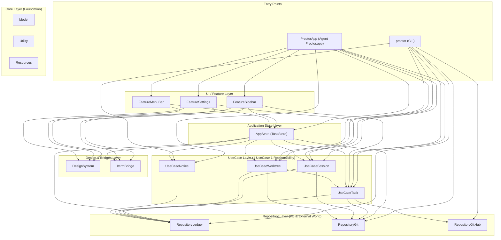

# Architecture

Proctor is organized as a multi-target Swift Package Manager (SPM) architecture without external package dependencies. The codebase strictly separates presentation, domain decision-making, and external I/O into distinct layers so that both the command-line interface (`proctor`) and the macOS menu bar application (`ProctorApp`) can share identical business logic without coupling.

## Dependency Diagram

> [!NOTE]
> This diagram illustrates high-level architectural relationships and primary data flow. To maintain visual clarity, non-essential compile-time dependency edges (such as ubiquitous dependencies on core foundation targets `Model`, `Utility`, and `Resources`, or entry-point aggregate dependencies on repositories and bridges) are intentionally omitted. `Package.swift` serves as the single source of truth for complete target dependency declarations.

## Layers and Responsibilities

| Layer | Target | Role and Boundary Rules |
| --- | --- | --- |
| **Core** | `Model` | Plain Swift data structures and vocabulary (`CollectedTask`, `TaskStatus`, `AgentKind`, etc.). Contains zero I/O and zero business decisions. |
| | `Utility` | Low-level process execution (`ProcessRunner`), filesystem paths (`Paths`), and app version helpers. |
| | `Resources` | Localized string tables and markdown templates. Exposes `Localized` helper. |
| **Repository** | `RepositoryLedger` | Gateway to the on-disk JSON state ledger (`~/.local/state/proctor/state.json`) with file-lock synchronization. |
| | `RepositoryGit` | Gateway to local git process execution (worktree listing, status checks, diff counts). |
| | `RepositoryGitHub` | Gateway to `gh` CLI (credential checks, PR lookups, avatar URLs) and `curl` (avatar image downloads). |
| **UseCase** | `UseCaseTask` | Task collection and diff change counting (`CollectTasks`, `CountChanges`, `CollectRecentRepos`, `ResolveRepoOrigin`, `ResolvePullRequest`, `ForgetTask`, `CheckOrganizationAvailability`, `FetchOrganizationAvatar`). |
| | `UseCaseSession` | Session state transitions, hooks, approvals, and reaping (`RecordHookEvent`, `RecordPendingApproval`, `RecordSessionStats`, `MarkSessionSeen`, `NameSession`, `ClearAttention`, `ReapClosedSessions`). |
| | `UseCaseWorktree` | Git worktree gathering, idle time measurement, and removable checks (`CollectWorktrees`). |
| | `UseCaseNotice` | User notification resolution and recency pacing (`CollectNotices`, `PaceRecounts`). |
| **Design & Bridges** | `DesignSystem` | Reusable UI design tokens, status glyphs, and palette colors (`StatusGlyph`, `Palette`). Presentation only. |
| | `ItermBridge` | AppleScript automation bridge for iTerm2 terminal integration and window focus management. |
| **Application State** | `AppState` | Observable `@MainActor` state stores (`TaskStore`) bridging background polling to SwiftUI views. Wraps ledger operations. |
| **Features** | `FeatureSettings` | Settings window views and notification/sidebar preferences (`SettingsView`, `NoticeSettings`). |
| | `FeatureMenuBar` | macOS menu bar extra status controller and popup menu (`MenuBarController`). |
| | `FeatureSidebar` | Slide-out sidebar views, task grouping, organization avatars, and folding controls (`TaskListView`, `TaskGrouping`). |
| **Entry Points** | `proctor` | Command-line tool entry point parsing arguments and calling UseCases directly for terminal output. |
| | `ProctorApp` | macOS desktop application entry point configuring menu bar, watchers, background reap cycles, and sidebar windows. |

## Architectural Constraints

- **No presentation concerns in logic or repository layers**: Terminal ANSI escape codes belong strictly to `Sources/proctor/Terminal.swift`, while AppKit/SwiftUI colors belong to `DesignSystem.Palette`. UseCase and Model layers only describe domain concepts.
- **Views do not access repositories directly**: View components (such as `FeatureSidebar`, `FeatureMenuBar`, and `FeatureSettings`) never touch Repository modules directly; they interact through `AppState.TaskStore`. The Repository layer is only accessed directly by UseCases, CLI commands, `AppState.TaskStore`, and `ProctorApp` background watchers (such as `ApprovalWatcher`).
- **Single aggregation entry point**: All task aggregation passes exclusively through `CollectTasks.collect()`. Presentation layers never perform ad-hoc task aggregations.
- **One UseCase, one responsibility**: Each UseCase struct or enum focuses on a single action named with specific domain verbs (`collect`, `record`, `resolve`, `clear`, `reap`, etc.). Mixed responsibilities are separated into dedicated use cases.
- **Zero external dependencies**: Proctor relies strictly on macOS system frameworks and local tools (`git`, `gh`). No third-party package dependencies are introduced.
